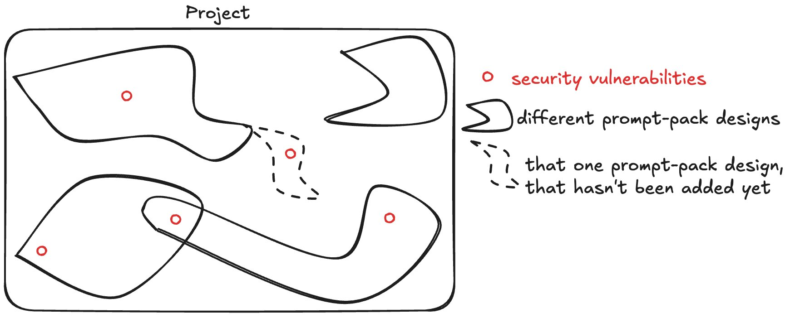

# DLT Auditor v1

Runtime-only audit orchestration for trained, specialized DLT audit designs.

This repo intentionally keeps the pieces needed to run existing designs:

- `designs/` - runnable audit prompt packs.
- `corpus/` - shared historical vulnerability corpus used by corpus-aware designs.
- `bin/` - thin wrappers for scaffolding and executing audit runs.
- `runs/` - ignored output directory for blind suites.

## How It Works

DLT Auditor runs trained, specialized prompt-pack designs against target repositories.

The main idea is that there is no single audit pipeline that tries to fit every project. Instead, the auditor has multiple prompt-pack designs, and each one is tuned toward a different project family, competition style, or vulnerability class. For a new target, you choose the design or designs that seem most relevant, then run them independently.



The diagram above is the mental model. A project can contain many different security vulnerabilities, and each prompt pack covers a different part of that space. Running more than one design can broaden coverage, but each design still runs in isolation so its output does not influence the others.

The designs are produced by starting with a default audit design and training it into a specialized prompt pack against a specific audit competition or target class. The AI runs the design, compares the output with confirmed findings, studies what it missed, and refines the prompts. That loop repeats until the prompt pack can identify all or almost all of the confirmed findings. The resulting prompt pack is what this repo runs.

The auditor also uses a dedicated corpus of DLT security fixes. It was built by scanning multiple DLT project GitHub histories and extracting security-relevant fixes, including public fixes, silent fixes, internally identified fixes, and fixes whose security relevance was not disclosed in the original project history. Corpus matches are used as search patterns and hypotheses for the current target. They are not evidence by themselves.

Each design lives under `designs/<name>/` and contains:

- `00_protocol_mapper.md` - map the target protocol and repository structure.
- `01_base_hunter.md` - hunt for issue families.
- `02_validation_and_impact.md` - validate reachability, attacker control, impact, and severity.
- `05_corpus_pattern_search.md` - retrieve historical corpus patterns as hypotheses.
- `prompts/` - focused family scan prompts.
- `bin/dlt-ai-audit-system` - scaffold a concrete audit run.
- `bin/run-parallel-codex` - execute the generated prompts with Codex or Claude workers.

The normal blind-suite flow is:

1. Select one or more designs with `--design`.
2. Copy each selected design into `runs/<suite-name>/design-workspaces/<design>/design/`.
3. Scaffold an audit run inside that copied design.
4. Inject blind-isolation instructions into every generated prompt.
5. Execute the phases in order: `mapper`, `corpus`, `scans`, `canonicalize`, `validations`, `aggregate`, `final`.
6. Store per-design results under the suite directory so runs can be resumed without mixing outputs.

The phases are:

- `mapper` - runs `00-protocol-mapper.md`; fills `repo-context.md`, seeds `feature-coverage.md`, and records concrete files, functions, state machines, trust boundaries, tests, and high-risk surfaces.
- `corpus` - runs `05-corpus-pattern-search.md`; searches `corpus/imports/`, records useful and rejected matches in `corpus-match-index.md`, and may create `corpus-pattern-candidates.md`.
- `scans` - runs every focused `scan-*.md` prompt, usually in parallel; each scan inspects one issue family and writes `family-scan-*.md` plus any candidate dossiers it finds.
- `canonicalize` - runs `80-canonicalize-candidates.md`; deduplicates candidates across scans, assigns stable candidate IDs, updates `candidate-index.md`, and prepares candidates for validation.
- `validations` - runs validation prompts for candidate dossiers, usually in parallel; each validation tries to disprove the candidate first, then records reachability, attacker control, existing checks, impact, severity, and confidence.
- `aggregate` - runs `95-aggregate-validated-findings.md`; merges surviving validated candidates into the final report set and updates candidate status files.
- `final` - runs `99-final-coverage-pass.md`; checks for uncovered protocol surfaces, weak evidence, unresolved placeholders, and finalizes the coverage/report artifacts.

Blind isolation means a worker may use only the target repository, its copied active design, its active run directory, and explicitly named corpus files. It must not read sibling suite outputs, stable `designs/*/runs/**` outputs, previous audit outputs, answer keys, or any other material not explicitly allowed by the generated prompt.

The default worker is Codex. Codex execution uses service tier `standard`, discovery reasoning `high`, deep reasoning `xhigh`, and deep phases `canonicalize,validations,aggregate,final`.

Claude Code is also supported with `--agent claude`. Claude uses its own CLI defaults; the Codex service-tier and reasoning flags are not passed to Claude.

## Use As A Codex Skill

This repo is also a Codex skill. The root `SKILL.md` and `agents/openai.yaml` let Codex load the DLT Auditor operating rules, choose prompt packs, and run the existing commands in `bin/`.

Install or link this repo as the `dlt-auditor` skill, for example:

```bash
ln -s /path/to/dlt-auditor ~/.codex/skills/dlt-auditor
```

Then invoke it from Codex prompts with one of three tiers:

```text
Use $dlt-auditor max on /path/to/target-repo with suite name target-max-01.
```

`max` runs every available prompt pack under `designs/`.

```text
Use $dlt-auditor optimal on /path/to/target-repo with suite name target-optimal-01.
```

`optimal` inspects the target repository and available design packs, chooses the best-fitting packs, up to 5 total, and runs one blind suite with those packs.

```text
Use $dlt-auditor custom on /path/to/target-repo with suite name target-custom-01 using design packs monad-c4 and fuel-core-attackathon.
```

`custom` runs exactly the prompt packs named by the user, after validating that each pack exists under `designs/`.

For Claude Code, include that in the prompt:

```text
Use $dlt-auditor optimal on /path/to/target-repo with suite name target-claude-01 using Claude Code.
```

These tiers are skill behavior, not shell subcommands. Codex interprets `$dlt-auditor optimal`, selects or validates the design packs, then runs `bin/run-blind-suite` with repeated `--design <name>` flags. The same blind-isolation rules still apply.

## List Designs

```bash
bin/run-blind-suite --list-designs
```

## Run One Design

Scaffold a run for a single design:

```bash
bin/run-design fuel-core-attackathon /path/to/target-repo \
  --run-name my-audit-run \
  --parallel-jobs 8 \
  --force
```

Then execute the generated run with that design's parallel runner:

```bash
designs/fuel-core-attackathon/bin/run-parallel-codex \
  designs/fuel-core-attackathon/runs/my-audit-run \
  --jobs 8 \
  --service-tier standard \
  --reasoning-effort high \
  --deep-reasoning-effort xhigh \
  --deep-phases canonicalize,validations,aggregate,final
```

To execute that run with Claude Code instead:

```bash
designs/fuel-core-attackathon/bin/run-parallel-codex \
  designs/fuel-core-attackathon/runs/my-audit-run \
  --agent claude \
  --jobs 8 \
  --claude-add-dir /path/to/target-repo
```

## Run A Blind Suite

Use this when you want to run multiple trained, specialized designs against the same target without letting one design's output influence another:

```bash
bin/run-blind-suite \
  --repo /path/to/target-repo \
  --suite-name my-blind-suite \
  --design monad-c4 \
  --design fuel-core-attackathon \
  --parallel-jobs 8
```

The suite copies each selected design into `runs/<suite-name>/design-workspaces/<design>/design/`, excludes design run output, scaffolds an audit run, injects blind-isolation instructions, and executes the design. With the default Codex worker, it uses:

- service tier: `standard`
- discovery reasoning: `high`
- deep reasoning: `xhigh`
- deep phases: `canonicalize,validations,aggregate,final`

To run the same suite with Claude Code:

```bash
bin/run-blind-suite \
  --repo /path/to/target-repo \
  --suite-name my-blind-suite \
  --design monad-c4 \
  --design fuel-core-attackathon \
  --agent claude \
  --parallel-jobs 8
```

The suite automatically passes the target repo and copied design workspace to Claude with `--claude-add-dir`.

To scaffold without launching workers:

```bash
bin/run-blind-suite \
  --repo /path/to/target-repo \
  --suite-name my-blind-suite \
  --design fuel-core-attackathon \
  --scaffold-only
```

If worker limits pause a suite, resume it without recreating completed items:

```bash
bin/run-blind-suite --suite-name my-blind-suite --resume
```

## Search The Corpus

```bash
bin/search-corpus \
  --query "transaction decoder unbounded list resource accounting" \
  --family resource_accounting_and_limits \
  --top-k 10
```

Corpus matches are hypothesis generators only. A finding still needs target-code reachability, attacker capability, a missing property, and concrete impact.
